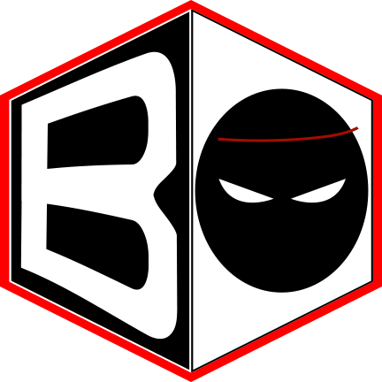

# Ball Odyssey

It's a platformer-puzzle game, simple and relaxing but also challenging. Travel through the worlds of our character's universe enjoying their variety.
Test your reflexes, balance and concentration in this fun adventure with an ever-growing world and level content.

This is a game (demo/protoype/vertical slice) developed by students from <a href="https://www.imagecampus.edu.ar/">Image Campus</a>

   

## Credits
(in alphabetical order)

- **Estéban Ferreira** - *Testing* -     
- **Lisandro Guevara** - *Programming & Game Design* -     
- **Nicolas Mendy** - *Art* -     
- **Rodrigo Peralta** - *Programming & Game Design* -     
- **Gerónimo Rath** - *Audio* -     

This game was also possible thanks to the support of these professors:

- **Sergio Baretto**
- **Jorge Cuéllar**
- **Fernando Puig**
- **Eugenio Taboada**

## Links

Download it from itch.io: https://alberto210.itch.io/ball-oddyssey
